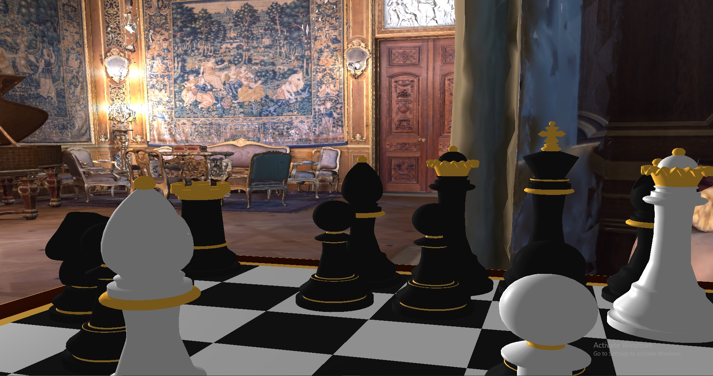
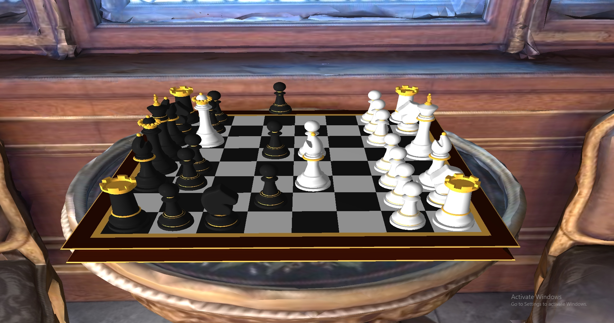

# Bilgisayar Grafikleri Final Projesi

Bu proje, **Visual Studio** kullanılarak geliştirilen bir **OpenGL** uygulamasıdır. Proje kapsamında, 3D grafikler, sahne oluşturma, model yükleme ve animasyon teknikleri uygulanmıştır. Proje, özellikle **çoban matı** (Scholar's Mate) temalı bir satranç sahnesinde gerçekleştirilmiştir.

📺 **Proje Videosu:** [YouTube'da İzle](https://youtu.be/-bge980TLYs)

---

## 🚀 Özellikler

- 3D sahnelerde satranç taşlarının ve ortamın görselleştirilmesi  
- **Assimp** kullanılarak model yükleme  
- Gerçekçi **gölgelendirme efektleri**  
- Texture kullanımı  
- Kamerayı birinci ve üçüncü şahıs modlarında kontrol etme  
- Gerçek zamanlı olarak **çoban matı animasyonu**

---

## 🛠️ Kurulum

### 🔷 Visual Studio Kullanarak Projeyi Açma

1. Bu depoyu bilgisayarınıza klonlayın:
   ```bash
   git clone https://github.com/ClosePrize/ComputerGraphics_FinalProject.git
   cd ComputerGraphics_FinalProject
   ```
2. Git LFS ile büyük model dosyalarını indirin:
   ```bash
   git lfs pull
   ```
3. 'ComputerGraphics_Project.sln' dosyasını Visual Studio ile açın.
4. DLL dosyalarının uzantısını projeye vermek için sol taraftaki solution explorer kısmından ComputerGraphics_FinalProject'e sağ tıklayarak properties kısmına girin. Debugging sekmesindeki environment kısmına aşağıdaki uzantıyı yapıştırın ve kaydedin.
   ```bash
   PATH=%PATH%;$(ProjectDir)Libraries\DLL
   ```
5. "Debug" modunda çalıştırarak projeyi doğrudan başlatabilirsiniz.

---

### 🔶 Visual Studio Kullanmadan Derleme

Alternatif olarak, projeyi terminal üzerinden manuel derleyebilirsiniz:

1. Depoyu klonlayın:
   ```bash
   git clone https://github.com/ClosePrize/ComputerGraphics_FinalProject.git
   cd ComputerGraphics_FinalProject
   git lfs pull
   ```

2. Projeyi şu şekilde derleyin:
   ```bash
   g++ -o project Main.cpp -lglfw -lGL -lGLEW -lGLU -lassimp
   ```

> Gerekli kütüphanelerin (GLFW, GLEW, OpenGL, Assimp) sisteminizde kurulu olduğundan emin olun.

---

## 📂 Teknik Bilgiler

- **Model Yükleme:** `Assimp` ile `.obj` formatındaki satranç taşı ve oda modelleri yüklendi.
- **Animasyon:** Satranç taşları belirli sıra ve zamanlamalarla çoban matını canlandıracak şekilde hareket etmektedir.
- **Kamera Kontrolü:** Serbest dolaşım (free cam) ve FPS modları arasında geçiş yapılabilmektedir.
- **Shader Kullanımı:** Gerçekçi ışıklandırma ve gölgelendirme efektleri için özel `vertex` ve `fragment` shader’ları yazılmıştır.

---

## 🖼️ Görseller

**1. Birinci Şahıs Kamera Görünümü:**



**2. Üçüncü Şahıs Kamera Görünümü:**



**3. Oda Görünümü:**


